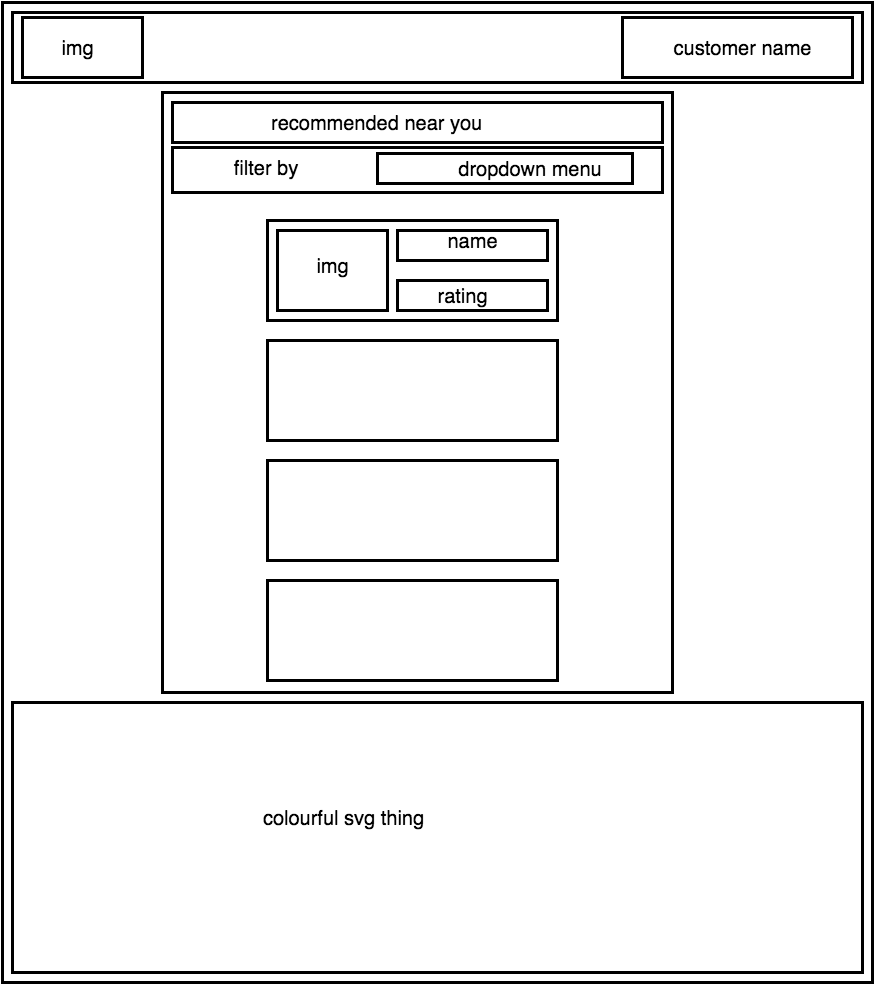
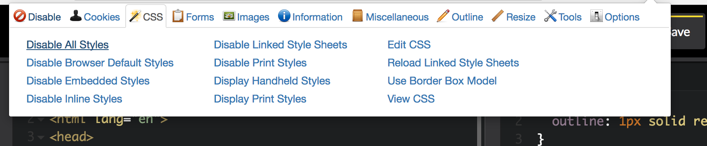

# Responsive Design and CSS Frameworks

#### In this lecture we will:

- Talk about the Box Model and Semantic HTML
- Learn what a framework is
- Learn how to use one
- Learn the principles of Responsive Design
- Look at how to make responsive layouts using Bootstrap


## The Box Model and Semantic HTML

- Everything is a Box



- Planning your layout should consist of visualising everything as a box and deciding where and how to stack, arrange and nest boxes.

- Some boxes behave differently
- Inline Vs Block elements
- `display: inline-block` Vs `float: left` for creating column layouts
- Clearfix for 'clearing' floats (e.g. [this codepen](http://codepen.io/harrietty/pen/WprBMO))

```css
.container:after {
   content: " ";
   visibility: hidden;
   display: block;
   height: 0;
   clear: both;
}
```

- Why are links blue?
- Some aspects of styling and behaviour are also applied automatically by the browser
- You can experiment with disabling styles using Chrome Web Developer Extension



## Another handy tip

- The Elements tab on the Chrome Inspector is your best friend when it comes to playing with and debugging CSS.


## The Box Model


### Margins, paddings, borders

- All HTML elements are modelled as rectangular boxes.

- Their size and positioning depends on a combination of height, width, margin, bordr, padding, and content.

It is important to understand the way the rendering engine in the browser calculates the size of elements based on these measurements:


The height and width properties of an element apply to the content area. Adding a margin to an element increases space around the element, which makes logical sense, but what might not be obvious is that padding and borders also add width onto the element itself, even though we think of the padding as something on the "inside".

**NB** Many elements have default margins and padding, sometimes a default border too e.g. form elements and tables. (E.g. [this codepen](http://codepen.io/harrietty/pen/xqZNpM))


`box-sizing: border-box` can used to force the padding and border into the inside of the content area so we can make more intuitive and simpler calculations about the sizing of elements.


## Semantic HTML

- Choosing the right element for the job is **Semantic HTML**. 

- It is is important for **making your life easier**, for **accessibility** reasons and for **legal reasons**:

#### Legal stuff:

    - It's actually a legal requirement. Access to internet was introduced as a human right in 2016, but the right to not face discrimination online was already in effect. This means it's illegal to discriminate against anyone by failing to make your website accessible

    - Court cases - Australian man sued Olympic Events website because he couldn't buy tickets because there was no way to submit a form without a mouse. In the UK, the RNIB regularly acts on behalf of blind/visually impaired people by approaching companies that are hard to navigate etc.

    - A form must be tabable and you must be able to submit or move onto the next page using the enter button. Links must also be tabbable (default behaviour of links) so using a div for a button because you don't want any of the default styling of a button is bad practice and unsemantic.


## Responsive Web Design

Why?

- Mobile visits account for over 50% of internet traffic in the US.

- In 2014 we saw the switch from a desktop browser being the most common client to mobile becoming more common.

- A [list apart article](http://alistapart.com/article/responsive-web-design) from 2010 is often credited with having been influential in the uptake of RWD. Prior to this time, it had been common to see fixed width layouts (800 * 1024 pixels), or maybe 2 completely different websites for mobile and web, or to see what is known as a fluid or liquid layout where relative units are used to allow content to shrink and scale to the width available, but this still raised the problem that on a small screen, a page shrunk with relative units would be far too small to read.

- The article proposed using and combining features that were already present in CSS in a different way. These were relative units and media queries.

### Relative Units

What units do we have available in CSS? Which ones are relative?

- pixels
- %
- vh, vw
- pt
- cm, mm, in


- Media queries were commonly used to provide different styling for print layouts (show example) where we might want to remove bright colours, change to a serif font, make sure images don't exceed the width of the page, and make sure lists etc don't break onto two pages, remove unnecessary elements, increasing side margins,

[Tips and tricks for print media queries](https://www.smashingmagazine.com/2013/03/tips-and-tricks-for-print-style-sheets/)

[codepen](http://codepen.io/harrietty/pen/vyLNJV?editors=1100#0)


### Mobile first Vs Desktop First

A principle that says you develop for mobile first of all and then work upwards, adding features to desktop versions of your site.

**'Progressive enhancement'** - you start with something that looks great and works on mobile

 Opposite of **'graceful degredation'**


## Frameworks

With RWD we can create complex layouts in columns, grids and tile arrangements that look great on all devices, but it can be a real pain and involve lots of fiddly calculations. Since it's such a common task to need a complex CSS stylesheet that responds gracefully, we might decide to use a framework rather than code it ourselves. (NB with CSS4 Grid this will be a lot easier and it might take the place of many frameworks once its well supported across all browsers. See Jen Kramer talk).

A framework is just CSS someone else wrote, which we can make use of by including in our project and giving our elements the correct classes to work with the framework.

There are simple frameworks such as Bulma and Skeleton and more complex frameworks such as Twitter's Bootstrap. Some frameworks just provide styles for a grid or tile layout [skeleton](http://getskeleton.com/), some also provide styles for specific elements and components, meaning that if you use that framework you get, out of the box, a specific 'look' for your site.

In the case of Bootstrap, the 'look' of the site you get is a look like Twitter, which is a strong branding exercise as we see a lot of the web looks like Twitter as a result of the success of it open sourcing its CSS framework.

## Including Bootstrap

Bootstrap already came included in your sprint starter repo, so take a look at the files in the public folder. It includes some fonts and has a jQuery dependency.

I simply downloaded the files from [Bootstrap](http://getbootstrap.com/getting-started/) and followed the instructions for including precompiles Bootstrap in a project.

## Using Bootstrap for layout

Bootstrap uses a 12-wide grid system. 

It uses a container to hold rows, each row holding up to 12 columns.

[Bootstrap codepen](http://codepen.io/harrietty/pen/VPQmGp?editors=1100#0)

Bootstrap is **mobile-first** meaning that its styling is written from mobile up, encouraging you to design for smaller screens and optimize up for larger screens if you need to.

We don't have to specify what happens as screen size increases because Bootstrap writes its styles as '750px and above' etc. so you are always covered as you increase in size, unless another set of styles overwrites it.

### Bootstrap components

You can also look at the different components Bootstrap provides. Sometimes the classes you need to use to achieve the desired componentns can be a little complicated but the documentation is pretty good and you can get quite far by copying and pasting example code.

You can of course modify the styles Bootstrap provides by linking your own stylesheet **after** Bootstrap's and overwriting style.

If you do this, make sure to give your elements their own classes, don't use Bootstrap ones because you need to use these all over your project and be confident they will behave as the documentation says they will.


## Responsive Web Design Resources

[RWD on A List Apart](http://alistapart.com/article/responsive-web-design)

[7 CSS Units you might not know](https://webdesign.tutsplus.com/articles/7-css-units-you-might-not-know-about--cms-22573)

[Tips and tricks for print media queries](https://www.smashingmagazine.com/2013/03/tips-and-tricks-for-print-style-sheets/)

[Media Query Codepen](http://codepen.io/harrietty/pen/vyLNJV?editors=1100#0)

[Media Queries on CSS Tricks](https://css-tricks.com/css-media-queries/)

[Complete Guide to Flexbox](https://css-tricks.com/snippets/css/a-guide-to-flexbox/)

[Media Querie.es - examples of good RWD](http://mediaqueri.es/)

[Skeleton framework](http://getskeleton.com/)

[Bootstrap framework](http://getbootstrap.com/css/)


## More Resources


[The CSS Box Model](https://css-tricks.com/the-css-box-model/)

[Bootstrap Documentation](http://getbootstrap.com/css/)

[Bulma Documentation](http://bulma.io/documentation/overview/start/)

[CSS4 Grid Conference Talk by Jen Kramer](https://www.youtube.com/watch?v=axVw1Zduqn0)